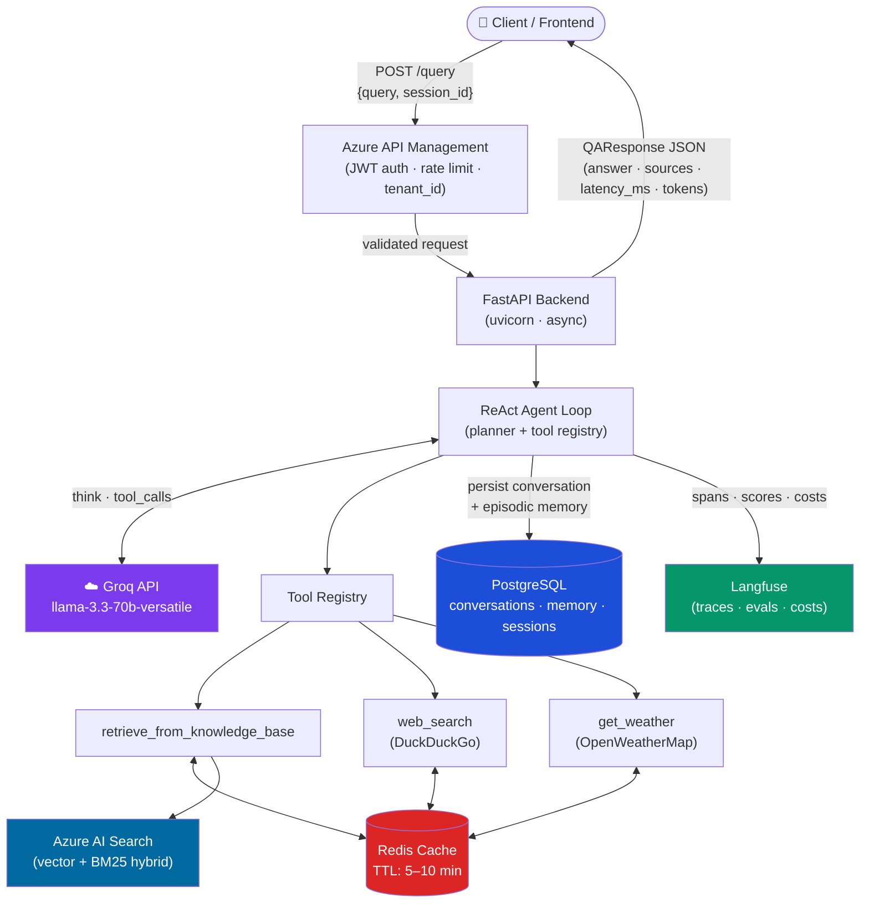
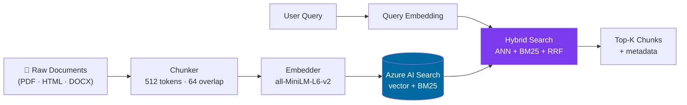
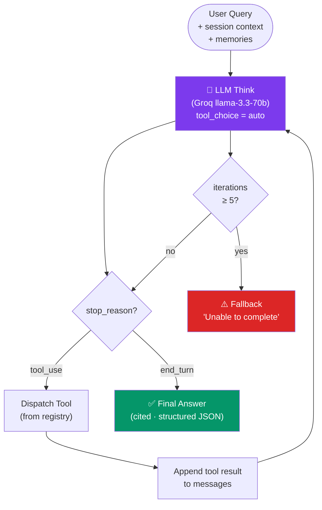
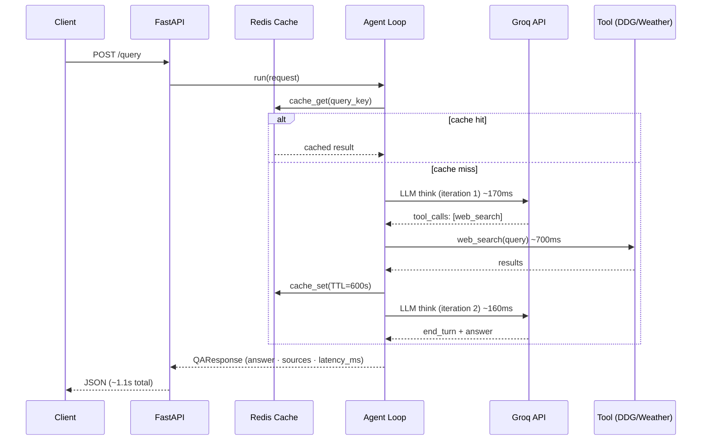
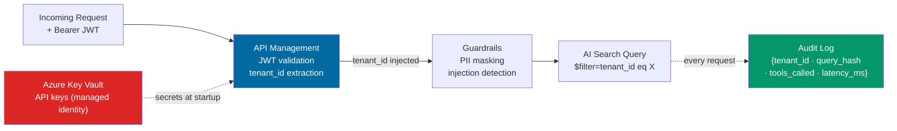
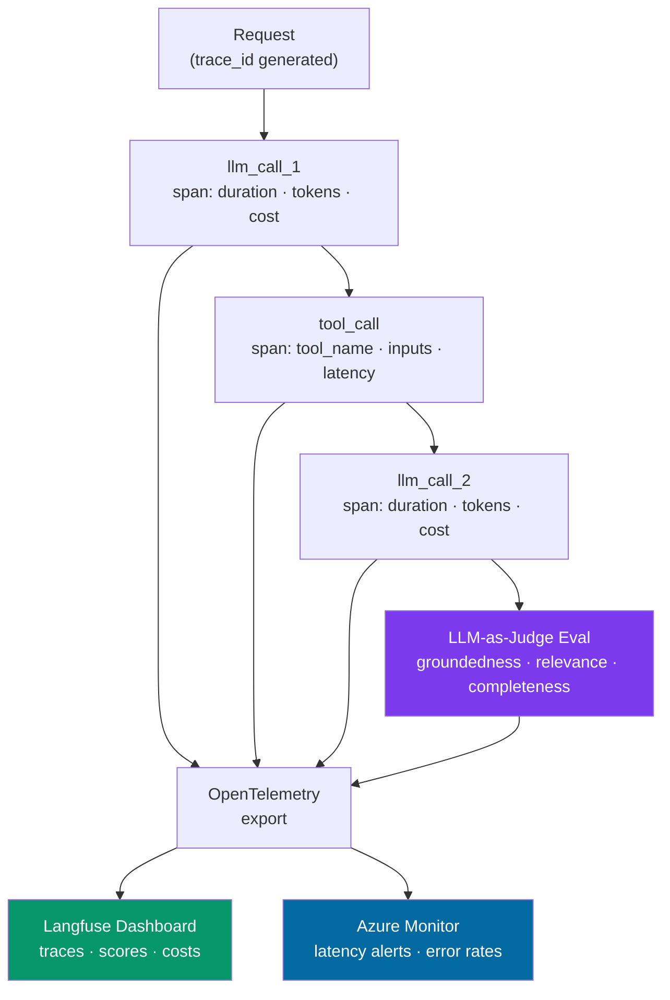
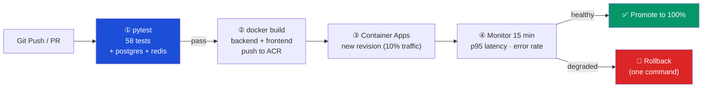

# Production RAG + Agents Architecture

## Overview

A multitenant "Answering over External Data" system combining Retrieval-Augmented Generation (RAG) with a tool-using agent layer. Users submit natural-language queries; the system retrieves relevant documents, calls live APIs as needed, and returns a grounded, cited answer.

---

## 1. Data Ingestion & Indexing

**Ingestion pipeline**: Documents are chunked into 512-token segments with 64-token overlap (preserves sentence context across boundaries). Each chunk is embedded using a local `sentence-transformers/all-MiniLM-L6-v2` model (zero cost, runs on CPU) — or swapped for `text-embedding-3-small` at $0.02/1M tokens when higher accuracy is needed. Embeddings are stored in **Azure AI Search** with both vector and BM25 keyword indexes.

**Hybrid search**: At query time, the agent calls a `retrieve_from_knowledge_base` tool that executes a hybrid query (vector ANN + BM25 keyword) and applies **Reciprocal Rank Fusion (RRF)** to rerank results. This outperforms pure vector search on keyword-heavy queries (e.g., product codes, names).

**Metadata**: Each chunk stores `tenant_id`, `source_url`, `document_title`, `last_updated`. These flow through as source citations in the final answer.

---

## 2. Agentic Layer: Planner & Tool Selection

The agent uses a **ReAct loop** (Reason + Act). At each step the LLM (`llama-3.3-70b-versatile` via Groq) decides whether to call a tool or produce a final answer. Tools are registered in a **ToolRegistry**; the planner receives all tool schemas and picks based on the query.

| Tool | Trigger |
|------|---------|
| `retrieve_from_knowledge_base` | Internal docs questions |
| `web_search` | Current events, external facts |
| `get_weather` | Weather queries |
| `currency_convert` | FX rate questions |

The system prompt instructs the model to explain its tool selection, enabling an auditable `reasoning_trace` in every response. Max iterations = 5 prevents runaway cost.

---

## 3. Cost, Latency & Caching

**Prompt caching**: System prompt and tool definitions marked with `cache_control: ephemeral` (1-hour TTL). Cache reads cost ~10% of normal input tokens — 60-90% savings on repeated queries.

**Vector cache**: Query embeddings cached in Redis (TTL 5 min) to avoid re-embedding identical queries.

**HTTP cache**: DuckDuckGo and weather responses cached in Redis by query key (TTL 10 min), gated by a semaphore (default: 5 concurrent external calls) to prevent thundering-herd.

**Latency budget** (P95 target: <5s):
- Embedding: ~50ms
- Vector retrieval: ~100ms
- LLM call (2 turns avg): ~1.5s each
- Total: ~3.5s

---

## 4. Security & Multitenancy

**RBAC**: Each API request carries a JWT with `tenant_id` and `role`. Azure API Management validates the token; the `tenant_id` is injected as a mandatory filter on every AI Search query (`$filter=tenant_id eq '{id}'`).

**Data isolation**: Tenant data stored in separate Azure AI Search indexes (strong isolation) or a shared index with row-level `tenant_id` filters (cost-efficient). Strong isolation recommended for regulated industries (healthcare, finance).

**Audit logging**: Every tool call and LLM interaction logged as structured JSON to Azure Monitor with `tenant_id`, `user_id`, `query_hash`, `tools_called`, and `latency_ms`. PII fields are hashed, not stored in plain text.

**Secret handling**: `GROQ_API_KEY` and external API keys live in **Azure Key Vault**, surfaced to the container at startup via managed identity — never in code or image layers.

---

## 5. Observability

**Traces**: Each request produces a trace tree (request → LLM calls → tool calls) via OpenTelemetry, exported to Azure Monitor Application Insights. Trace IDs are included in API responses for client-side correlation.

**Metrics** (structured JSON logs ingested by Azure Monitor):
- `request_latency_ms` (p50, p95, p99)
- `token_usage` (prompt, completion, cache_hit_rate)
- `tool_call_count` and `tool_error_rate` per tool
- `iterations_per_request`

**Budgets & alerts**: Alert if p95 latency > 8s or token cost per request > $0.05. Dashboard panels show latency breakdown by step to identify bottlenecks.

**Failure dashboards**: Separate panels for tool timeouts, LLM API errors, policy violations, and max-iteration breaches.

---

## 6. Deployment

**Containerized**: Service packaged as a Docker image (python:3.12-slim). Image published to Azure Container Registry on every main branch push.

**CI/CD** (GitHub Actions):
1. `test` job: `pytest` full suite
2. `build` job: `docker build` + push to ACR
3. `deploy` job: update Azure Container Apps revision

**Blue/green / canary**: Azure Container Apps supports traffic splitting. New revisions receive 10% traffic initially; automatic promotion to 100% if p95 latency and error rate stay below thresholds for 15 minutes. Rollback is a one-command revision reactivation.

**Scaling**: Container Apps scales 1→20 replicas on HTTP request queue depth. Each replica handles ~50 concurrent async requests. At 1000 req/min peak, 2-3 replicas suffice.

